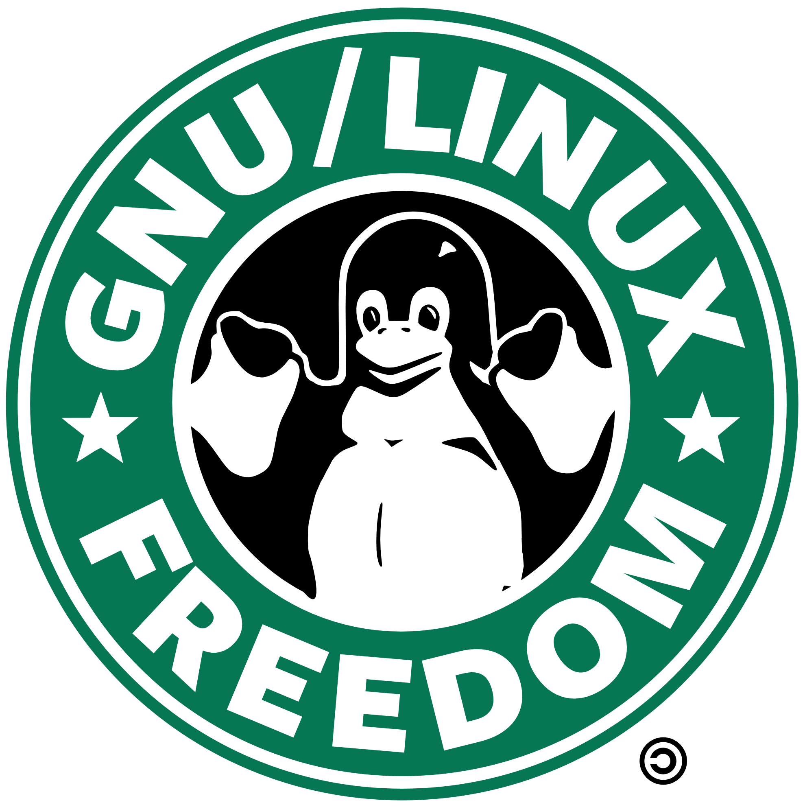

<h2 align="center">Xinux | Lokalizatsiya</h2>

<b><a href="https://github.com/ismoilovdevml" target="_blank">@ismoilovdev</a> boshchiligida <a href="https://xinux.uz" target="_blank">Xinux Jamiyati</a> tomonidan qilingan tarjimalar.</b>

## Ushu loyiha

Tarjima qilinmagan DE yoki WM dasturlari uchun o'zbek tilida tarjimalar yetkazish uchun xizmat qiladi.
Asosan hamma protsessni sentrallashtirish uchun yaratilgan repozitoriya hisoblanadi va kuzatib borish, hamda
birga ishlash osonlashtiradi.

## Qatnashish uchun

Ushbu repozitoriyada tarjima ishlari boshlashdan avval, telegramdagi asosiy guruhimizad
qaysi qismlarni qilish kerakligi haqida ko'proq ma'lumot so'rab oling va kelishing! Agar muammolar
yuz beradigan bo'lsa yoki savollar, [ismoilovdev](https://t.me/ismoilovdev) ga murojaat qiling.

## O'z ichiga oladigan DE va WM lar:

- [Gnome](https://l10n.gnome.org/teams/uz/)
- [KDE](https://l10n.kde.org/team-infos.php?teamcode=uz)
- [XFCE](https://translations.launchpad.net/linuxmint/latest/+lang/uz)
- [Cinnamon](https://explore.transifex.com/xfce/)

> Bu proyekt hozirda faol rivojlantirilmoqda. Agarda bironta xatolikka duchor
> bo'lsangiz, xatolik haqida [e'lon](https://github.com/uzinfocom-org/i10n/issues/new)
> qoldirishni unutmang.

## Sponsorlik

Agar ushbu loyihada ancha ter to'kgan bo'lsangiz va o'zingizni sponsoringiz bo'lishiga loyiq deb topsangiz, [@uwussimo](https://t.me/uwussimo) ga
sponsorlik uchun murojaat qiling. Murojaat qilishdan avval [Payme](https://payme.uz) da o'z shaxsiy hisobingiz va shu bilan birgalikda ochiq URL shaklida
pul o'tkazish uchun qulay sahifangiz yaratishingizni iltimos qilib qolamiz!

<b>Barcha huquqlar himoyalangan &copy; 2021-2022 <a href="https://xinux.uz" target="_blank">Xinux Jamiyati</a></b>

